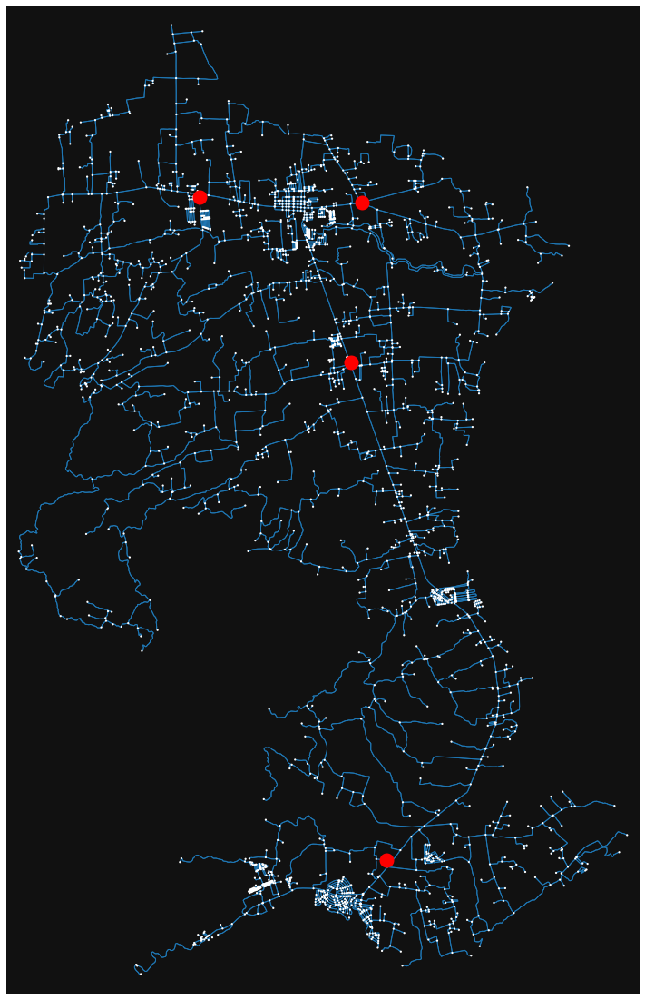
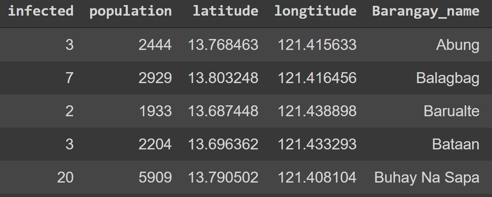
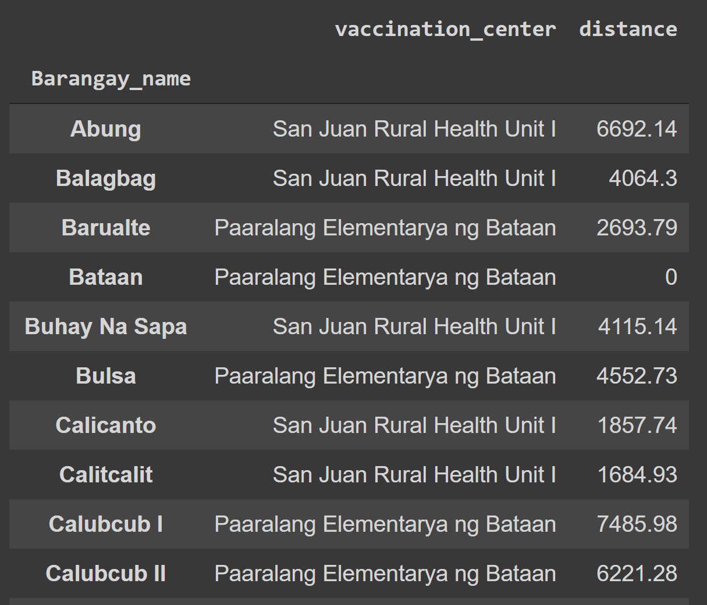

# Vaccination-Site-Optimization
Python Jupyter notebook for the paper "Optimal Location of COVID-19 Vaccination Sites" by Cabanilla et al, 2022.


## Description

Identify the best L covid vaccination centers in a given town or region based on the optimization methodology of the paper.  The optimization relies on the proximity of the vaccination sites to the local village centers along with the number of COVID cases and population densities within each barangay.

In this notebook, we show how it can applied for the town of San Juan, in the province of Batangas, Philippines. 

## Getting Started 

A Google Colaboratory version of the notebook can be accessed through:
https://colab.research.google.com/drive/1Dd_odqnrRP_vverLk32BdxxidYfF5EuV?usp=sharing

Alternatively, one can download the covid_site_optimization.py file in this repository.

Users must find the Open Street Maps (OSM) area code of the region they want to apply the vaccination site optimization on.  For instance, the area code for this example is a simple "San Juan, Batangas, Philippines".

User would then need to supply and load two datasets to Python Jupyter to run this notebook as shown in the paper.  

The first, titled the 'Village_Centers_Table.xlsx' contains the names of the local government/village centers in the given region, their respective latitudes and longtitudes, total population of its jurisdiction, and the total number of infected in its jurisdiction.  It must have the following schema:

[](Village_Centers_Table.png)

The second, titled the 'Vaccination_Centers_Table.xlsx' contains the names of the available vaccination centers to select from, their respective latitudes and longtitudes, and the name of the local government unit it is in.  It must have the following schema:

[](Vaccination_Centers_Table.png)

For replication purposes, the two datasets regarding the specific applicaption of the optimiation algorithm for San Juan, Batangas are in this repository,
### Dependencies

* The main library used is OSMNX which is the Python API for Open Street Maps

### Executing the program
The first two cells is just for importing dependencies and for defining the core functions

Let's say we want to find the two most optimal vaccination centers in San Juan, Batangas, Philippines.  We simply run the following function
```
assignment = optimal_sites(L = 4, vaccination_centers_df = vacc, villages_df = vill,
                        graph_area = ("San Juan, Batangas, Philippines"))
```
The variable "L" simply denotes the number of covid vaccination centers to be optimized.  If L=2, then it will find the two best centers for the entire region.  There are three choices for distance, namely straightline euclidean distance, road distance, or time traveled distance.  By default we use road distance for the optimization due to its greater realism.

The region of the analysis must also be supplied in the ```graph area``` variable as a string.

This function will output a dataframe showing the vaccination center assingments of each barangay in the region.  Furthermore it will print two things, a graph showing the geographic map of the area with the locations of the vaccination centers and barangay centers, and the distribution of the barangay areas between the set of optimal covid vaccination centers:


[](output.png)


## Help

For issues and help regarding this repository, you can email me at
```
kaisercabanilla@gmail.com
```


## Authors
Kurt Izak Cabanilla
Erika Enriquez
Renier Mendoza
Vicki Paguio Mendoza

## Version History
* 2
    * Initial Release

